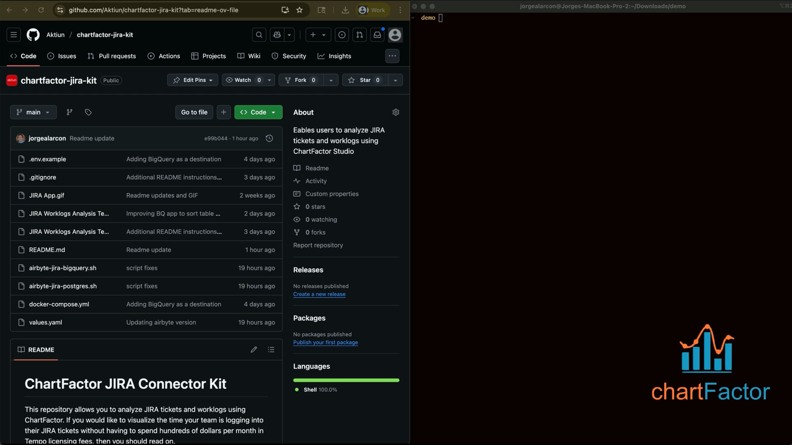

# ChartFactor JIRA Connector Kit

This repository allows you to analyze JIRA tickets and worklogs using ChartFactor. If you would like to visualize the time your team is logging into their JIRA tickets without having to spend hundreds of dollars per month in Tempo licensing fees, then you should read on.

**4-min video walkthrough**

[](https://www.youtube.com/watch?v=Clf5Rw2drhY)

This connector includes two options for the data warehouse: 

* Postgres: Lower onboarding barrier since it is included as a docker compose service. Consider using this data engine as a destination for small data volumes (e.g. less than 10GB) or for testing purposes.
* BigQuery: Recommended for larger data volumes and for full governance. You can easily switch to BigQuery after proving the value of the solution using the Postgres option.

# Pre-requisites

You need to have the following in your machine:

* Docker Desktop installed
* Ports `8000` and `5433` available

# Steps

## 1. Setting up abctl 

abctl is Airbyte's command-line tool for deploying and managing Airbyte. Airbyte is an open-source data integration platform that moves data from various sources into data warehouses. 

If you are using a Mac, use Homebrew to install Airbyte's abctl.

a. Install Homebrew, if you haven't already.

b. Run the following commands after you install Homebrew.

```commandline
brew tap airbytehq/tap
brew install abctl
```

Please refer to Airbyte's [Quickstart documentation - Install abctl](https://docs.airbyte.com/platform/using-airbyte/getting-started/oss-quickstart#part-2-install-abctl) to install abctl if you are using Linux or Windows.

## 2. Run the connection setup script - Postgres

This script automates the end-to-end setup for syncing Jira data into ChartFactor Studio:

1. Deploys Airbyte in a local Docker environment.

2. Configures Airbyte by creating source, destination, and connection definitions to stream Jira issues and worklogs into the “jira” schema of a Dockerized PostgreSQL instance.

3. Prepares the ChartFactor import by generating the “JIRA Worklogs Analysis – PG.cfs” file, which contains all the visualization settings ready for use in ChartFactor Studio.

To run the script, follow the steps below:

a. Clone the [chartfactor-jira-kit](https://github.com/Aktiun/chartfactor-jira-kit.git) repo using the command below.

```commandline
git clone https://github.com/Aktiun/chartfactor-jira-kit.git
```
b. Nagivate to the folder where the project was cloned.

```commandline
cd chartfactor-jira-kit
```

c. Copy the `.env.example` file to `.env` and fill in the JIRA variables. No need to fill-in the BigQuery variables.

```commandline
cp .env.example .env
```

d. Execute the command below in your terminal window. Please make sure ports 8000 and 5433 are available in your local computer. 

```commandline
./airbyte-jira-postgres.sh
```

Note that the Airbyte installation itself may take up to 30 minutes depending on your internet connection. When it completes, your Airbyte instance opens in your web browser at http://localhost:8000. The next section covers how to obtain Airbyte's password for your local instance.

## 3. Airbyte Admin Setup

Now that the script is finished, let’s log-in into our Airbyte install to look into the connection we created and review its periodic update configuration. Steps below:

a. Obtain the password of your local airbyte install.

```commandline
abctl local credentials
```

b. Open the browser at http://localhost:8000, enter an email, organization, and paste the password obtained in the previous step.

You can now user Airbyte's administration console to review the newly created connection and update its periodic update configuration if needed. Out-of-the-box, the connection is configured to update every 24 hours. 

## 4. Visualize using ChartFactor Studio


Open [ChartFactor Studio](https://chartfactor.com/studio) and use the "Import" function located in the top-right corner of the Studio home page, to import the `JIRA Worklogs Analysis - PG.cfs` file. Then, select the imported application to open it.

You should now be able to use your Studio application to:

✔ Easily narrow down team members and time windows by dragging your mouse on top of the Heat Map, Trend, and Barchart visualizations. 

✔ Open the JIRA ticket for a specific worklog by selecting its URL on the "Work Logs" table. 

✔ Reset filters by selecting "Remove All" in the Interaction Manager section at the top right. 

✔ And if you have any questions on additional functionality, please reach out using our [Community Forum](https://community.chartfactor.com/).

# Using Google BigQuery instead of Postgres

Use BigQuery when you need governance and for larger data volumes. To set up the Google BigQuery, you need to have:

* The Google Cloud Platform (GCP) Project ID
* The location of the dataset (e.g. US)
* The BigQuery Dataset ID where tables will be replicated to
* The path to the JSON service account key file. Refer to the [Create and delete service account keys](https://cloud.google.com/iam/docs/keys-create-delete) article if you need help generating this key

Follow the steps below to set up BigQuery as the data warehouse for Jira data:

a. Nagivate to the folder where the [chartfactor-jira-kit](https://github.com/Aktiun/chartfactor-jira-kit.git) repo was cloned as described in previous sections.

b. Update the `.env` file to provide the BigQuery variables. The BigQuery variable names start with "BQ".

c. Execute the command below in your terminal window. 

```commandline
./airbyte-jira-bigquery.sh
```
    
After the script completes, open [ChartFactor Studio](https://chartfactor.com/studio) and use the "Import" function located in the top-right corner of the Studio home page, to import the `JIRA Worklogs Analysis - BQ.cfs` file.

Same as when using Postgres, you should now be able to use your Studio application to:

✔ Easily narrow down team members and time windows by dragging your mouse on top of the Heat Map, Trend, and Barchart visualizations. 

✔ Open the JIRA ticket for a specific worklog by selecting its URL on the "Work Logs" table. 

✔ Reset filters by selecting "Remove All" in the Interaction Manager section at the top right. 

✔ And if you have any questions on additional functionality, please reach out using our [Community Forum](https://community.chartfactor.com/).

# Uninstalling the connector

To uninstall the connector components, follow the steps below:

1. Nagivate to the folder where the [chartfactor-jira-kit](https://github.com/Aktiun/chartfactor-jira-kit.git) repo was cloned as described in previous sections.
2. Uninstall Airbyte using the commands below.

```commandline
abctl local uninstall --persisted
rm -rf ~/.airbyte/abctl
```
3. Uninstall the Postgres container and remove its data with the command below.

```commandline
docker compose down -v
rm -rf ./postgres.db
```

4. To remove your Google BigQuery dataset, use the GCP [Delete datasets](https://cloud.google.com/bigquery/docs/managing-datasets#delete-datasets) documentation.

